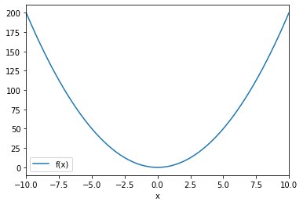

```python
# The first cell is reserved for parameter declaration used by nbparameterise.
# Must initialize as string!
polynome = [2,0,0]
```


```python
%matplotlib inline

# disable warnings in output:
import warnings
warnings.filterwarnings('ignore')

# enable interpolated markdown generation
from IPython.display import display, Markdown

import matplotlib

import datetime as dt
import numpy as np
import pandas as pd

from functools import reduce
from matplotlib import cm
from matplotlib import pyplot as plt
```

# Example


```python
display(Markdown(f'''Received polynome parameters: **{ polynome }**'''))
```


Received polynome parameters: **[2, 0, 0]**


```python
s = '+'.join(f'{"" if n == 1 else n if n % 1 else int(n)}{f"x^{exp}" if exp > 1 else "x" if exp == 1 else ""}' 
               for exp,n in reversed(list(enumerate(reversed(polynome)))) if n!=0) or '0'
s = s.replace('+-', '-')

display(Markdown(f'''Evaluating function: $fn(x)={ s }$'''))
```


Evaluating function: $fn(x)=2x^2$


plotting function from given parameters:


```python
fn = lambda x: sum(n*x**exp for exp,n in enumerate(reversed(polynome)))
pd.DataFrame([(x, fn(x)) for x in np.linspace(-10, 10, num=1000)], columns=['x', 'f(x)']).set_index('x').plot();
```




